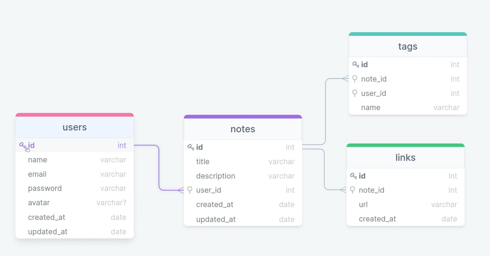

  

   
   

  

    <a href="#-exercicio">Rocketnotes</a>&nbsp;&nbsp;&nbsp;|&nbsp;&nbsp;&nbsp;
    <a href="#-tela">Tela</a>&nbsp;&nbsp;&nbsp;|&nbsp;&nbsp;&nbsp;
    <a href="#-demonstracao">Demonstração</a>&nbsp;&nbsp;&nbsp;|&nbsp;&nbsp;&nbsp;
    <a href="#-contato">Contato</a>
  

  
  

## Rocketnotes
O Rocketnotes é uma aplicação de notas, na qual os usuários podem se cadastrar e criar de forma organizada anotações sobre determinados assuntos, tendo disponível a adição de titulo, descrição, links e tags para cada nota, além de contar a edição de perfil do usuário, podendo alterar seu avatar, nome, email e senha, entre outras funcionalidades.

## Banco de dados
Nessa aplicação foi utilizado banco de dados relacional (SQL). Para ambiente de desenvolvimento seguiremos com o SQLite pela facilidade do ambiente.

### Estrutura Bando de dados

## Contato
Se você tiver alguma dúvida ou quiser entrar em contato, você pode me enviar uma mensagem pelo
[LinkedIn](https://www.linkedin.com/in/joao-sillva/).

(<a href="#readme-top">voltar ao topo</a>)
